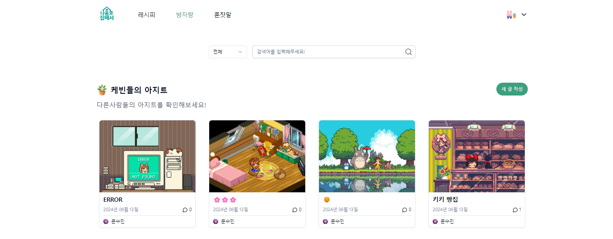

<div align="center">

## 나홀로집에

`나홀로집에`는 세상의 모든 케빈들의 외로움을 공유할 수 있는

1인 가구를 위한 소통의 장입니다.

혼자만의 생활을 더 풍요롭게 만들고 싶다면, 우리 커뮤니티를 이용하여

일상을 나눠보세요!

<br>
<a href ="https://www.na-holo.site">
    <p align="center">
      
    </p>
</a>
👆🏻 이미지를 클릭하여 사이트로 이동하세요!<br><br>

⚙️ In progress<br>
2024.05.15 ~ 2024.06.15<br><br>
🛠️ Currently being improved<br>
2024.07.11 ~ <br><br>

## Front

<table style="width: 100%;">
  <tr>
    <td style="width: 14%; text-align: center;"></td>
    <td style="width: 14%; text-align: center;"></td>
    <td style="width: 14%; text-align: center;"></td>
    <td style="width: 14%; text-align: center;"></td>
  </tr>
  <tr>
    <td style="width: 14%; text-align: center;"><a href=""><strong>FE 문수민</strong></a></td>
    <td style="width: 14%; text-align: center;"><a href=""><strong>FE 안동현</strong></a></td>
    <td style="width: 14%; text-align: center;"><a href=""><strong>FE 이수민</strong></a></td>
    <td style="width: 14%; text-align: center;"><a href=""><strong>FE 이슬</strong></a></td>
  </tr>
</table>
<br>

## BackEnd

<table style="width: 100%;">
  <tr>
    <td style="width: 14%; text-align: center;"></td>
    <td style="width: 14%; text-align: center;"></td>
  </tr>
  <tr>
    <td style="width: 14%; text-align: center;"><a href=""><strong>BE 권예지</strong></a></td>
    <td style="width: 14%; text-align: center;"><a href=""><strong>BE 유기원</strong></a></td>
  </tr>
</table>
<br>

## Initial BackEnd

<table style="width: 100%;">
  <tr>

  </tr>
  <tr>
    <td style="width: 14%; text-align: center;"><a href=""><strong>팀장 안수민</strong></a></td>
    <td style="width: 14%; text-align: center;"><a href=""><strong>팀원 유기원</strong></a></td>
    <td style="width: 14%; text-align: center;"><a href="https://github.com/mylazysundaycat"><strong>팀원 권예지</strong></a></td>
    <td style="width: 14%; text-align: center;"><a href=""><strong>팀원 장성규</strong></a></td>
    <td style="width: 14%; text-align: center;"><a href=""><strong>팀원 홍유나</strong></a></td>
    <td style="width: 14%; text-align: center;"><a href=""><strong>팀원 고민성</strong></a></td>
    <td style="width: 14%; text-align: center;"><a href=""><strong>팀원 노석규</strong></a></td>
  </tr>
</table><br>

</div>

## FrontEnd 소개

나홀로집에서 프로젝트는 React + TypeScript를 사용합니다.

**단일 페이지 애플리케이션(SPA)** 으로 구현되었습니다.

백엔드 서버는 `Spring Boot`로 구성되어 있으며, IP 주소 및 도메인 접속 시 `8080` 포트로 리버스 프록시 설정이 되어 있습니다.

전체 프로젝트는 `src` 디렉토리 하위에 있는 패키지들입니다.

패키지에 대한 설명은 아래와 같습니다.

| 이름              | 설명                       | PORT |
| ----------------- | -------------------------- | ---- |
| homealone-project | 나홀로집에서 메인 프로젝트 | 8060 |

## 실행 방법

Package Manager는 `yarn` 을 사용하고 있습니다.

만약 `yarn` 이 없다면 전역에 `yarn` 을 먼저 install 합니다.

```sh
$ npm install --global yarn
# or
$ npm i -g yarn
```

`yarn`을 install 완료하면 dependencies 를 install 합니다.

```sh
$ pnpm
# or
$ yarn install
```

전체 dependencies가 install이 완료되면 최상위 경로에서

```
$ yarn dev
```

명령어를 입력하여 프로젝트를 실행합니다.

.env 설정

```sh
$ cp .env.info .env
```

.env에 실제 환경변수 값을 넣어야합니다.

## 모든 프로젝트

모든 프로젝트는 개발툴로 [`vite`](https://ko.vitejs.dev/guide/)를 사용하고 transpiler로는 [`swc`](https://swc.rs/)를 사용중입니다.

상태관리로는 클라이언트는 [`zustand`](https://docs.pmnd.rs/zustand/getting-started/introduction), 서버는 [`@tanstack/react-query`](https://tanstack.com/query/latest/docs/framework/react/overview)를 사용합니다.

스타일 라이브러리는 [`tailwind`](https://tailwindcss.com/docs/installation) + [`shadcn/ui`](https://ui.shadcn.com/docs) 를 사용합니다.

```
코어: React + typescript
번들러: vite
트랜스파일러: swc
상태관리:zustand + @tanstack/react-query
스타일: tailwindcss + shadcn/ui
```
